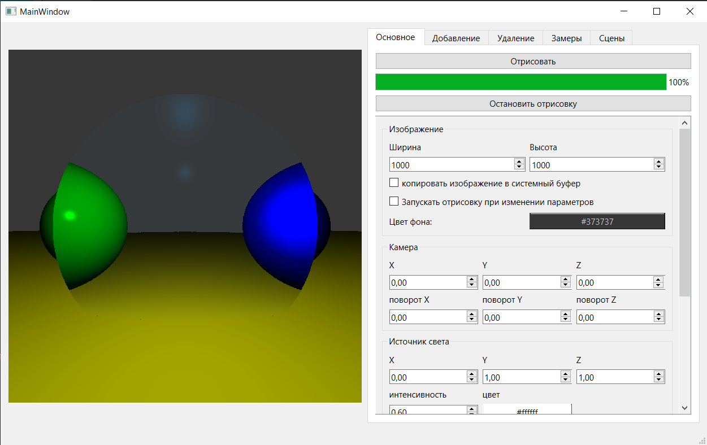

### Техническое задание
Разработать программное обеспечение, которое должно позволять визуализировать эффекты искажения изображения, получаемые с помощью двояковыпуклой линзы. Интерфейс должен предоставлять возможность размещать объекты на сцене из заданного набора примитивов (параллелепипед, призма трехгранная, сфера, пирамида четырехгранная), изменять цвет их поверхности, коэффициенты диффузног и зеркального отражения света. Программное обеспечение должно позволять размещать линзу в пространстве, изменять ее показатель преломления, радиус кривизны, ориентациюв пространстве. Обеспечить возможность задавать один источник света и его координаты, цвет и интенсивность. Пользователь должен иметь возможность устанавливать относительно любой координатной оси координаты и угол поворота камеры.

### Известные баги
- при `extended_mode=true` в интерфейсе появляется:
    - флажок включения теней, полигональные объекты затеняют сами себя, со сферами работает нормально
    - поле для задания коэффициента преломления добавляемого объекта, добавление и удаление таких объектов крашает программу
- в рпз сбита нумерация страниц, по идее надо начинать с 3

### Хотелось бы добавить/улучшить
- возможность настройки размера и удаленности от камеры окна просмотра (класс `Camera`, поля `wv`, `vh`, `d`)
- разделить код по хедерам и файлам реализации адекватно, а не как сейчас
- все места в коде где используется `dynamic_cast` переделать с использованием визиторов (визиторы нужно сделать)
- убрать все магические числа в коде
- возможность управлять положением камеры через клавиатуру (wasd)
- добавить гизмо камеры
- "обратная синхронизация" данных с интерфейсом, то есть функция для установки в поля интерфейса значений, которые сейчас на самом деле 
- базовый класс для воркеров
- редактирование уже добавленных объектов
- возможность изменять сразу обра радиуса линзы одновременно
- многопоточная отрисовка
- редактирование уже добавленных объектов
- изпользование opengl
- отвязать `Tracer` от использования `QPixmap`, лучше `QPainter`
- отвязать программу от наличия gnuplot и скриптов рядом с программой

### Ссылки на ресурсы
- https://habr.com/ru/articles/342510/
- https://habr.com/ru/articles/436790/
- https://web.archive.org/web/20110617075634/http://cgm.computergraphics.ru/issues/issue19/globalillum
- https://ophysics.com/l12.html

### Пример работы программы

### Замечания при сдаче от комиссии
- При выборе алгоритма был выбран тот, у которого больше всего минусов, очевидно почему (он проще), однако с точки зрения "вам нужно продать ваш проект комиссии" является плохой тактикой (речь про то, что нужно представить это с хорошей стороны)
- Цель исследования - исследование ради исследования, это хорошо в высокой науке и для данной работы вообще всем такое прощается, но лучше было выбрать другую цель, например применимость программы, то есть насколько комфортно ею пользоваться обычному юзеру (речь про время ожидания генерации картинки)
- темой работы должно быть ПО, а не разработка ПО, потому что разработка - это процесс